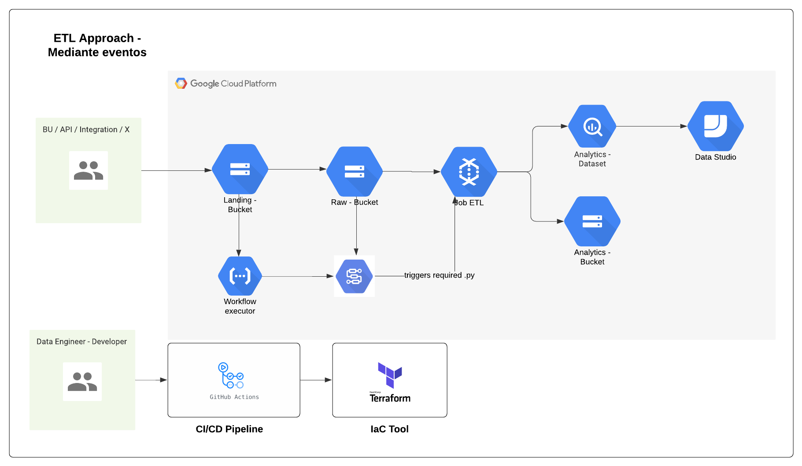
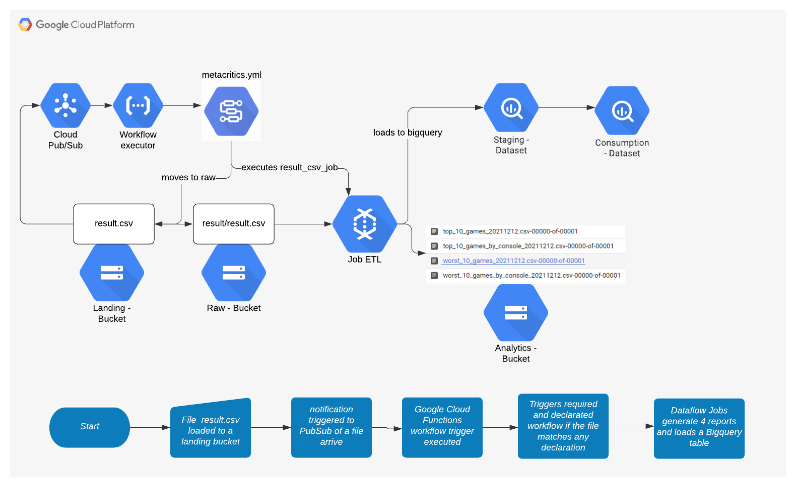
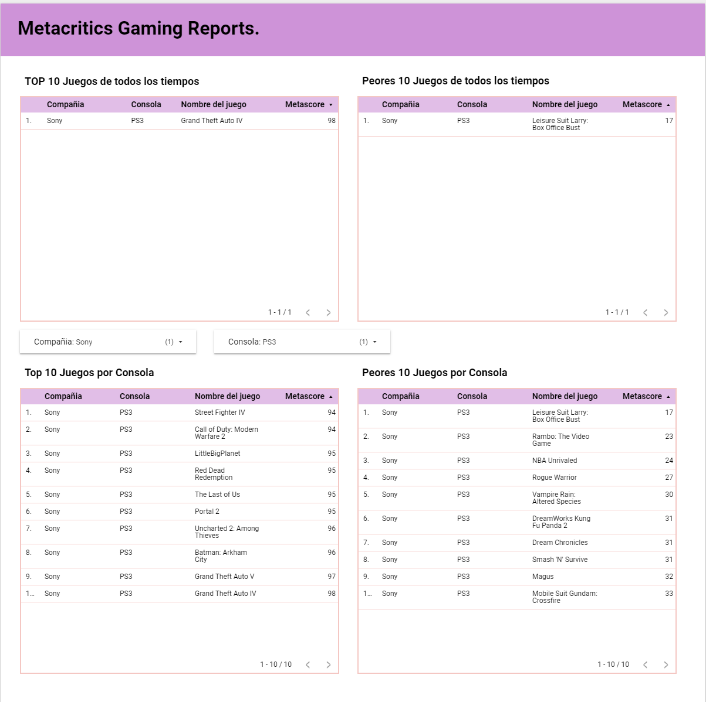

# DE Challengue Solution

---

## Draft - TODO:

* Desing & Architecture :white_check_mark:
* Infraestructure base with terraform :white_check_mark:
* Automatic deployment with Github actions :white_check_mark:
* Folder generation structure :white_check_mark:
* Gherking feature creation :white_check_mark:
* Tests with pytest bdd creation and automated execution :white_check_mark:
* Workflow trigger GCF creation and deployment :white_check_mark:
* Workflows yaml creation and deployment :white_check_mark:
* Dataflow template creation :white_check_mark:
* Latest test fixes  :white_check_mark:
* 3NF Model: :white_check_mark:
* Last documentation :white_check_mark:
* Visualization :white_check_mark:
* Steps to reproduce documentation :white_check_mark:

---

## Requirements Resume

* The programming language must be Java, Scala or Python.
* A consumption data model must be created, expected in 3NF.
* Generate the data model, and save it with a specific format and as image.
* Generate some reports like:
    * The top 10 best games for each console/company.
    * The worst 10 games for each console/company.
    * The top 10 best games for all consoles.
    * The worst 10 games for all consoles. The data is in the folder data/ in the root. The report can be exposed in any
      way you want, but remember this is an ETL Job.
* The deployment must work on any environment

## Restrictions and BU Rules

* GCP can be used
* ELT Approach can be used

---

## Data architecture diagram

Based on the previous requirements, I designed three types of architectures with a resume of the problems and why would
I choose it.

The following was the chosen one:



This architecture works as event driven, the ETL Job is executed in the exact moment that a file arrives into the
system, but it has some problems like:

* Reports complexity construction
* Multi dependency files to build a report
* Only append - no dedup strategy

But it has some good things like:

* Reports executed in the moment of the arrival of the file.
* Reports already processed saved as files and tables.

*About the other diagrams*:

https://lucid.app/lucidchart/3bdfd770-c1cc-4921-8986-bd8602bc7404/edit?invitationId=inv_e7c9d347-d92b-4c51-ac93-e8b5307dec7e

## Resume & Workflow

In this challenge I have developed a little framework, that handles the file arrive into a landing GCP Bucket,
consolidates it into a Raw bucket. after these previous steps, if a dataflow job declaration exists, it gets executed
using the previous raw file. In this case as example, we upload the files result.csv and consoles.csv, they get joined
into a single table and get loaded together to bigquery. also in the same dataflow job, extract four reports in .csv
file in the analytics bucket.

As resume we have the following diagram:



---

## Steps to reproduce

This project exists in two GCP environments (own projects), but can be deployed in another projects if required using
the GitHub Actions pipeline already created in the project. but first you will have to configure some things like:

* Set GitHub environments: test - prod with the following secret for each one:
    * GOOGLE_APPLICATION_CREDENTIALS = json value of a Service account key related to a GCP Project with owner
      permissions
* Replace on the following files the next key values:
    * .github/workflows/code_artifacts_deployment.yml
    * .github/workflows/code_artifacts_test_deployment.yml

```
env:
  GCP_PROJECT_ID: de-challengue-test # Replace for your own project ID's
  ARTIFACTS_BUCKET: de-challengue-test-artifacts # Terraform will create this bucket, 
  # But you will have to execute it before. or set by just changing the project_id  in the bucket
```

* You will have to update the properties file related to the infrastructure creation like:
    * src/resources/infra.ini

```
[PROD]
landing_bucket : de-challenge-336404-metascore-lnd # Must replace for your's own resource
raw_bucket : de-challenge-336404-metascore-raw # Must replace for your's own resource
analytics_bucket : de-challenge-336404-metascore-raw # Must replace for your's own resource
staging_dataset : staging
project_id: de-challenge-336404  # Must replace for your's own resource
artifacts_bucket : de-challenge-336404-artifacts  # Must replace for your's own resource
temporary_bucket: de-challenge-336404-temporary-pipeline  # Must replace for your's own resource

[TEST]
landing_bucket : de-challengue-test-metascore-lnd  # Must replace for your's own resource
raw_bucket : de-challengue-test-metascore-raw  # Must replace for your's own resource
analytics_bucket : de-challengue-test-metascore-analytics  # Must replace for your's own resource
artifacts_bucket : de-challengue-test-artifacts  # Must replace for your's own resource
staging_dataset : staging
project_id: de-challengue-test  # Must replace for your's own resource
temporary_bucket: de-challengue-test-temporary-pipeline  # Must replace for your's own resource
```

* If you want to create the infrastructure using the project terraform you will have to configure the following to
  files:
    * infraestructure/terraform/de-challenge/0_config.tf
    * infraestructure/terraform/de-challenge-test/0_config.tf

```
locals {
  project_id     = "de-challengue-test" # Must replace for your resource
  project_number = 935901401525 # Must replace for your resource
  default_region = "us-central1"
  defaul_zone    = "us-central1-a"
  owner_users    = ["zahidale.zg@gmail.com"] # Set required persons as IAM Level
  editor_users   = [ "zahid.galea@wom.cl"] # Set required persons as IAM Level
  viewer_users   = [] # Set required persons as IAM Level
}

```

In case if u want to try the project itself in my environment, u should be able to access to google cloud storage, and
add a file into the landing bucket. You will also be able to look the entire process running.

--- 

## Reports

About the required reports they will exists in two places.

* In the analytics bucket as .csv file
* In the consumption layer of bigquery dataset as views. (construction of them in the file "
  datamodel/bigquery_reports_views.ddl")

Also you can see the report in datastudio, here:

https://datastudio.google.com/reporting/3a0cde97-2402-4bd1-a826-0ff12b3778c4

It should looks like:

